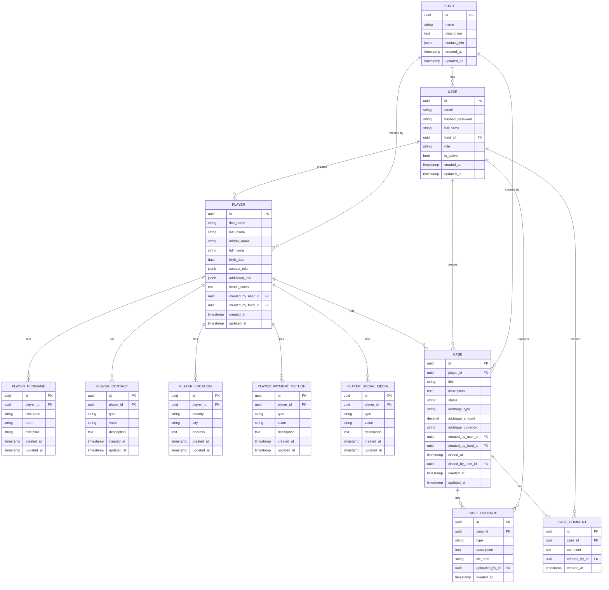

# Диаграмма базы данных FondsRelations

Ниже представлена диаграмма базы данных в формате Mermaid, которая визуализирует структуру и связи между таблицами.

Данная диаграмма показывает все основные сущности системы и их связи:

1. **Fund (Фонд)** - базовая организационная единица
2. **User (Пользователь)** - пользователи системы, привязанные к фондам
3. **Player (Игрок)** - информация об игроках
4. **PlayerNickname/Contact/Location/PaymentMethod/SocialMedia** - связанная информация о игроках
5. **Case (Дело)** - дела, связанные с игроками
6. **CaseEvidence (Доказательства)** - доказательства, прикрепленные к делам
7. **CaseComment (Комментарии)** - комментарии к делам

## Основные отношения

- Фонд может иметь множество пользователей
- Пользователь может создавать игроков и дела
- Игрок может иметь множество связанных данных (ники, контакты, локации и т.д.)
- Дело связано с одним игроком, но у игрока может быть множество дел
- К делу можно прикреплять доказательства и комментарии

## Изоляция данных

Важным аспектом системы является изоляция данных между фондами. Это реализовано через:

1. Привязку пользователей к фондам (поле `fund_id` в таблице `USER`)
2. Сохранение информации о создателе для каждого игрока и дела (поля `created_by_user_id` и `created_by_fund_id`)
3. Программную проверку принадлежности всех сущностей к фонду текущего пользователя при доступе к данным

## Изменения в схеме

Последние изменения в схеме базы данных:

1. Добавлены поля для структурированного имени игрока (`first_name`, `last_name`, `middle_name`)
2. Добавлено поле `health_notes` для хранения заметок о здоровье игрока
3. Добавлены таблицы для методов оплаты (`PLAYER_PAYMENT_METHOD`) и социальных сетей (`PLAYER_SOCIAL_MEDIA`)
4. Добавлены поля для информации об арбитраже в таблице `CASE` (`arbitrage_type`, `arbitrage_amount`, `arbitrage_currency`)
5. Добавлено поле `description` в таблицу `CASE_EVIDENCE`
6. Создана новая таблица `CASE_COMMENT` для комментариев к делам 